# SpecGen - AI-Powered Speculative Fiction Generator

> A unified Express.js application serving API backend with integrated React frontends for admin and user interfaces

## 🏗️ Architecture Overview


## 🛣️ API Routes Structure

```mermaid
graph LR
    subgraph "API Endpoints"
        Root["/api<br/>📋 Server Info"] 
        
        subgraph "Admin Management"
            AdminCat["/api/admin/categories<br/>📂 CRUD Categories"]
            AdminParam["/api/admin/parameters<br/>⚙️ CRUD Parameters"] 
            AdminSet["/api/admin/settings<br/>🔧 App Configuration"]
        end
        
        subgraph "Content Operations"
            Generate["/api/generate<br/>✨ Create Stories & Images"]
            ContentList["/api/content<br/>📄 List & Filter Content"]
            ContentItem["/api/content/:id<br/>📄 CRUD Single Content"]
            ContentSummary["/api/content/summary<br/>📊 Statistics"]
            ContentYears["/api/content/years<br/>📅 Available Years"]
        end
        
        subgraph "Image Serving"
            ImageOrig["/api/images/:id/original<br/>🖼️ Full Resolution"]
            ImageThumb["/api/images/:id/thumbnail<br/>🖼️ Thumbnail"]
        end
        
        subgraph "System & Health"
            Health["/api/system/health<br/>💚 System Status"]
            Ping["/api/health/ping<br/>🏓 Quick Check"]
            DbInit["/api/system/database/init<br/>🗄️ Initialize DB"]
            DbStatus["/api/system/database/status<br/>📊 DB Statistics"]
            Docs["/api/system/docs<br/>📚 API Documentation"]
        end
    end
    
    style Generate fill:#e8f5e8
    style Health fill:#fff3e0
    style AdminCat fill:#f3e5f5
```



## 📋 Complete API Reference

### Admin Management
| Method | Endpoint | Description |
|--------|----------|-------------|
| `GET` | `/api/admin/categories` | List all categories |
| `GET` | `/api/admin/categories/:id` | Get specific category |
| `POST` | `/api/admin/categories` | Create new category |
| `PUT` | `/api/admin/categories/:id` | Update category |
| `DELETE` | `/api/admin/categories/:id` | Delete category |
| `GET` | `/api/admin/parameters` | List parameters (filter by category) |
| `GET` | `/api/admin/parameters/:id` | Get specific parameter |
| `POST` | `/api/admin/parameters` | Create new parameter |
| `PUT` | `/api/admin/parameters/:id` | Update parameter |
| `DELETE` | `/api/admin/parameters/:id` | Delete parameter |
| `GET` | `/api/admin/settings` | Get application settings |
| `PUT` | `/api/admin/settings` | Update settings |

### Content Operations  
| Method | Endpoint | Description |
|--------|----------|-------------|
| `POST` | `/api/generate` | Generate new story + image |
| `GET` | `/api/content` | List content (with pagination/filters) |
| `GET` | `/api/content/summary` | Get content statistics |
| `GET` | `/api/content/years` | Get available years for filtering |
| `GET` | `/api/content/:id` | Get specific content item |
| `GET` | `/api/content/:id/image` | Get image information |
| `PUT` | `/api/content/:id` | Update content |
| `DELETE` | `/api/content/:id` | Delete content |

### Image Serving
| Method | Endpoint | Description |
|--------|----------|-------------|
| `GET` | `/api/images/:id/original` | Get original resolution image |
| `GET` | `/api/images/:id/thumbnail` | Get thumbnail image |

### System & Health
| Method | Endpoint | Description |
|--------|----------|-------------|
| `GET` | `/api` | API information and available endpoints |
| `GET` | `/api/system/health` | Comprehensive system health check |
| `GET` | `/api/health/ping` | Simple ping for load balancers |
| `POST` | `/api/system/database/init` | Initialize database schema |
| `GET` | `/api/system/database/status` | Database statistics |
| `GET` | `/api/system/docs` | Interactive Swagger documentation |
| `GET` | `/api/system/docs.json` | OpenAPI specification |

## 🚀 Quick Start

### Prerequisites
- Node.js >= 18.0.0
- npm >= 8.0.0

### Installation & Setup
```bash
# Clone repository
git clone https://github.com/gv-sh/sg2.git
cd sg2

# Install dependencies
npm install

# Set up environment variables
cp .env.example .env
# Edit .env with your configuration
```

### Development
```bash
# Start development server (builds React apps + starts server)
npm run dev

# Server will run on:
# - Development: http://localhost:3000
# - Production: http://localhost:8000 (or PORT env var)
```

### Production
```bash
# Build React applications
npm run build

# Start production server
npm run start
```

## 📁 Project Structure

```
sg2/
├── src/
│   ├── server/           # Express.js backend
│   │   ├── routes/       # Modular route handlers
│   │   │   ├── admin.ts     # Admin management endpoints
│   │   │   ├── content.ts   # Content & generation endpoints  
│   │   │   ├── system.ts    # Health & system endpoints
│   │   │   └── index.ts     # Route aggregation
│   │   ├── config.ts     # Configuration management
│   │   ├── middleware.ts # Validation & error handling
│   │   ├── services.ts   # Database & AI services
│   │   ├── schema.ts     # Database schema
│   │   └── server.ts     # Main application entry
│   ├── shared/           # Shared components & utilities
│   ├── admin/            # Admin React interface
│   └── user/             # User React interface
├── tests/                # Test suites
├── public/               # Static assets
└── build/                # Production builds
```

## ⚙️ Configuration

### Environment Setup

1. **Create environment file:**
```bash
# Copy example environment file
cp .env.example .env
```

2. **Add your OpenAI API key:**
```bash
# Edit .env file and add your API key
OPENAI_API_KEY=your_actual_openai_api_key_here
```

3. **Get OpenAI API Key:**
   - Visit [OpenAI Platform](https://platform.openai.com/api-keys)
   - Create new API key
   - Copy and paste into `.env` file

### Environment Variables

```env
# Server Configuration  
PORT=3000                           # Development port (prod: 8000)
NODE_ENV=development                # Environment: development/production/test
HOST=localhost                      # Server host

# AI Configuration (REQUIRED)
OPENAI_API_KEY=your_key_here        # OpenAI API key for GPT and DALL-E

# Database
DB_PATH=./data/specgen.db           # SQLite database path

# CORS & Security (Production)
ALLOWED_ORIGINS=https://yourdomain.com  # Comma-separated origins
API_BASE_URL=https://api.yourdomain.com # For Swagger docs

# Logging
LOG_LEVEL=info                      # Logging level: error/warn/info/debug
```

### Port Configuration
- **Development**: Single port 3000 (API + React apps served together)
- **Production**: Port 8000 behind nginx proxy
- **Testing**: Port 3000 with rate limiting disabled

## 🧪 Testing

```bash
# Run all tests
npm test

# Server-specific tests
npm run test:server

# Admin interface tests  
npm run test:admin

# User interface tests
npm run test:user

# Type checking
npm run type-check
npm run type-check:server
```

## 📦 Available Scripts

| Command | Description |
|---------|-------------|
| `npm run dev` | Start development server with hot reload |
| `npm run build` | Build React applications for production |
| `npm run start` | Start production server |
| `npm test` | Run all test suites |
| `npm run lint` | Lint all source code |
| `npm run type-check` | TypeScript type checking |
| `npm run clean` | Clean build artifacts and database |

## 🎯 Key Features

### 🤖 AI-Powered Generation
- **OpenAI GPT-4** for creative story generation
- **DALL-E 3** for accompanying artwork
- **Smart prompting** with cultural context for India/Global South
- **Configurable parameters** via admin interface

### 🛡️ Security & Performance
- **Rate limiting** with configurable windows
- **Request validation** with Zod schemas
- **Error handling** with detailed logging
- **CORS protection** for cross-origin requests
- **Helmet.js** security headers
- **Response compression**

### 📊 Administration
- **Category management** for story parameters
- **Parameter configuration** with validation rules
- **Content moderation** and editing capabilities
- **System health monitoring**
- **Settings management**

### 🎨 User Experience
- **Interactive content generation** with real-time feedback
- **Image processing** with thumbnails and optimization
- **PDF export** capabilities  
- **Responsive design** for all devices
- **3D visualizations** with Three.js

## 🔧 Development

### Database Schema
The application uses SQLite with the following main entities:
- **Categories** - Grouping for generation parameters
- **Parameters** - Configurable options for story generation
- **Generated Content** - Stories with metadata and images
- **Settings** - Application configuration

### API Documentation
Interactive API documentation is available at `/api/system/docs` when the server is running.

### Code Organization
- **Routes** - Modular endpoint handlers in `/src/server/routes/`
- **Services** - Business logic in `/src/server/services.ts`
- **Validation** - Zod schemas in `/src/server/middleware.ts`
- **Configuration** - Centralized config in `/src/server/config.ts`

## 🚀 Deployment

### With Nginx (Recommended)
```nginx
server {
    listen 80;
    server_name yourdomain.com;
    
    location / {
        proxy_pass http://localhost:8000;
        proxy_set_header Host $host;
        proxy_set_header X-Real-IP $remote_addr;
    }
}
```

### Environment Setup
1. Set `NODE_ENV=production`
2. Configure `ALLOWED_ORIGINS` for CORS
3. Set `API_BASE_URL` for documentation
4. Use `PORT=8000` or custom port
5. Start with `npm run start`

## 📝 License

ISC

## 🔗 Links

- **Repository**: https://github.com/gv-sh/sg2
- **Issues**: https://github.com/gv-sh/sg2/issues
- **API Docs**: Available at `/api/system/docs` when server is running

---

**Previous repositories** (archived):
- https://github.com/gv-sh/specgen-server  
- https://github.com/gv-sh/specgen-admin
- https://github.com/gv-sh/specgen-user